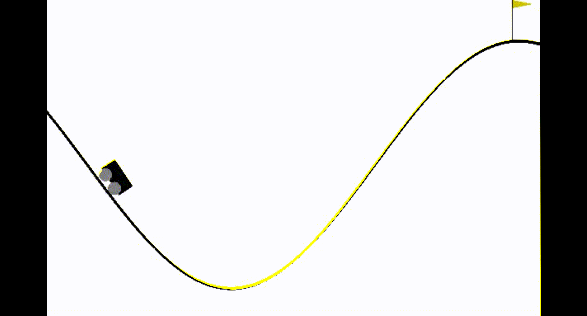
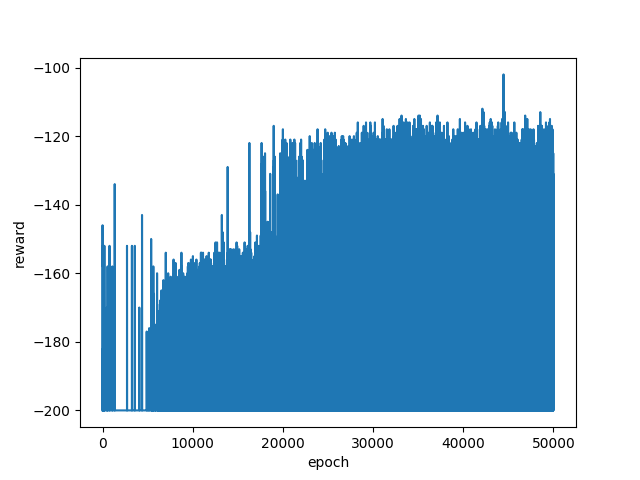

# Discrete Markov Decision Processes for Q-Learning in openai Gym

Classical MDP implementation to solve the MountainCar problem in the openai gym environment.

### Brief problem recap

An under-powered car needs to reach the goal on top of a hill. Do to so it needs to first build momentum.
The reward system adds a negative reward of -1 each timestep and a big reward of +200 when the agent reaches the goal. 

### Reward engineering

A secodary reward source has been added to boost the initial part of the learning process.
A small reward of +5 is given to an agent if he sets the record for the min distance reached from the goal.
This reward stream depletes as soon as the first agent reaches the goal but is strong enough to set the learning in the right direction.

### Discrete space

Observation space axis have been discretized in 200 steps to match the classic MDP requirements.
The Q(s,a) function is represented by a 200x200x3 matrix (3 is the action space).

### Media

_Total reward received for each epoch_

